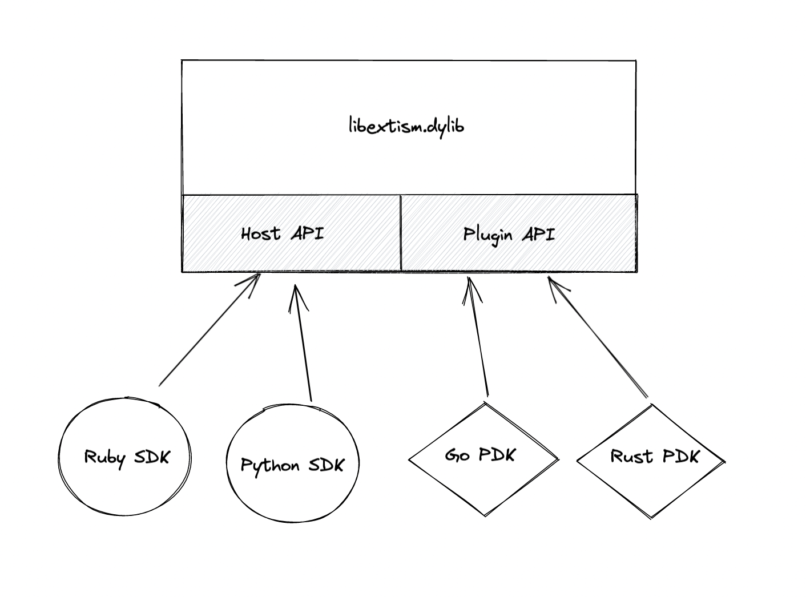
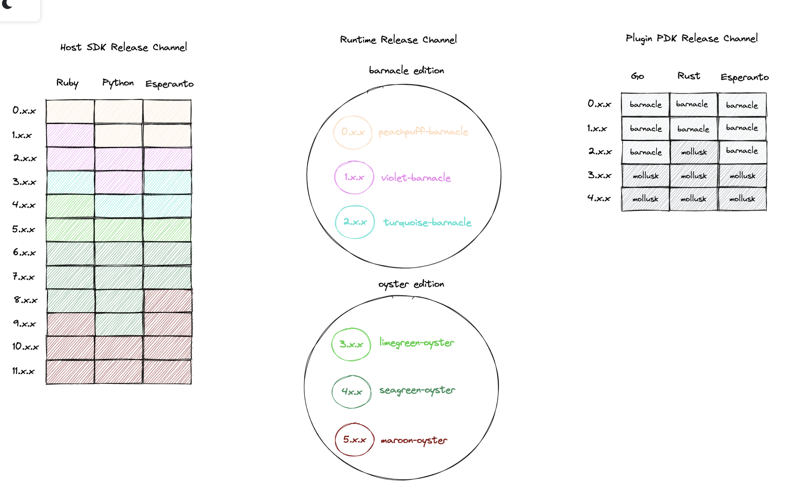

#  Extism Versioning System

## Purpose

Extism has many separate release channels. There are three categories of software in the ecosystem:

a. The Host SDKs
b. The Plugin PDKs
c. The runtime (the shared library)

If `a` is the number of host languages we support, and `b` is the number of PDK languages we support. The total number of release channels is:

```
a + b + 1
```

There are two goals for the versioning system:

1. When developing a host or a plugin, the programmer should be able to trust that their Extism dependency respects semver. At minimum this means we should not push breaking changes without a major version bump.
2. There needs to be a simple way to understand what version of the runtime your dependency is compatible with.

A naive solution would be to release all channels in the ecoysytem in lockstep. For example, when the runtime goes from 1.x.x to 2.x.x, all the host SDKs should go to 2.x.x and all the plugin PDKs should go to 2.x.x. The primary issue here iis that this does not communicate actual compatibilty changes. Furthermore, we will have instances where individual channels, e.g. Ruby Host SDK, will need breaking changes but the rest of the ecosystem does not. 

## Solution

The solution rests on two principles:

1. We will use semver for each release channel. Each channel can be released indpendently of other components of the ecosystem. In this way, the semver version will only communicate to the programmer the relative changes in the channel, but not communicate compatibility with other parts of the ecoysystem.
2. Compatibility will be determined by a 2-word, codeword system. Each major version release of the runtime will get a new codeword. The first word will indicate Host compatibility and the second word will indicate Plugin compatibility. The codeword will be of the form `<html-color>-<sea-creature>`.

The key to understanding this is to look at the ecosystem as having two coupling points, or two "APIs". The Host API and the Plugin API:



Changes in the Host API will break the SDK libraries but not the PDKs and vice versa. We may encounter contradicitons to this but we should hopefylly be able to limit the changes to just the SDK. The Plugin API should rarely change as it breaks the entire world of built plugins. But the Host API may change more frequently. Thus we have decided to tie the version of the runtime to breaking changes in the Host API. Every new major bump in the runtime will represent a breaking change in the Host SDK. Rarely, a major bump in the runtime will indicate a breaking change in the Host OR the Plugin API. 

The following is a hypothetical future state of the ecoystem:

